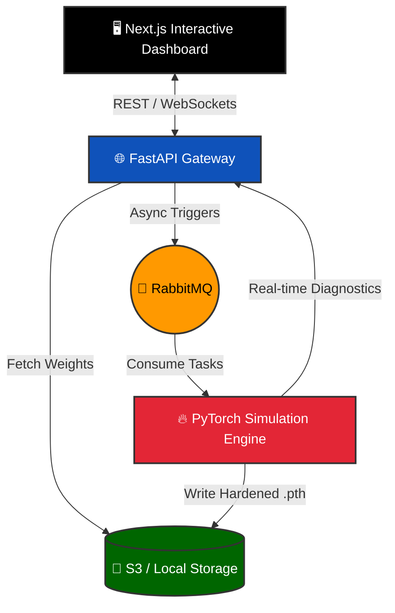

<div align="center">

# 🛡️ AdvGuard: Proactive Adversarial Defense Framework
**Integrating Lifecycle Robustness in Machine Learning Models for Cybersecurity**

[]()
[]()
[]()
[]()
[]()

</div>

---

**AdvGuard** is a highly scalable, modular ecosystem designed to embed threat simulation and dynamic defense generation natively within an MLOps pipeline. By focusing on tabular network telemetry, AdvGuard ensures that modern intrusion detection systems are resilient against cutting-edge **Adversarial Machine Learning (AML)** exploits.

> [!IMPORTANT]
> **Why AdvGuard?** As deep learning architectures rapidly replace conventional rule-based filters in Security Operations Centers (SOCs), their vulnerability to mathematically engineered input distortions has become a severe operational hazard. AdvGuard provides autonomous, real-time threat resistance.

---

## ✨ Key Innovations

- 🎯 **Multi-Faceted Threat Simulation Backend**  
  A PyTorch-powered evaluation engine capable of generating rapid gradient shifts (**FGSM, PGD**), targeted feature mapping (**JSMA**), and complex distance-minimization routines.
  
- 🔐 **Discrete Adversarial Constraint Mapping (DACM)**  
  Our novel algorithmic process forces continuous mathematical noise to snap back to valid categorical boundaries (via Euclidean distance minimization), ensuring adversarial cyber-payloads remain structurally executable in network parsers.
  
- ⚡ **Decoupled Event-Driven MLOps Integration**  
  Evaluates algorithmic threats efficiently by separating GPU-heavy threat generation from lightweight UI dashboards via asynchronous message brokering.

---

## 🏗️ Architecture Topology

AdvGuard physically separates UI components from computationally intensive threat generation to ensure enterprise-grade scalability.



### Component Breakdown
- **Frontend UI**: A Next.js dashboard providing interactive diagnostics and real-time metric tracking.
- **FastAPI Gateway**: Handles configuration injection and orchestrates the microservices logic.
- **PyTorch Simulation Engine**: A GPU-bound microservice that constructs and evaluates mathematically engineered payloads against targeted tensors.

---

## 🔬 Empirical Validation

Empirical evaluations conducted on the **NSL-KDD** and **CICIDS2017** datasets confirm the necessity and efficacy of the AdvGuard platform. 

When exposed to an aggressive perturbation limit of **ϵ = 0.15** via FGSM:

> [!WARNING]
> **Baseline Collapse**  
> Unmitigated models experienced a massive accuracy drop from **98.60%** down to **39.20%**.

> [!CAUTION]
> **Ensemble Inadequacy**  
> Standard multi-model consensus provided highly superficial protection, collapsing to **73.50%** under heavy strain due to adversarial transferability.

> [!TIP]
> **AdvGuard Hardening (Success!)**  
> The architecture subjected to integrated adversarial training sustained a robust accuracy of **93.00%**, effectively crippling evasion success rates without diminishing baseline predictive capabilities.

---

## 🚀 Getting Started

### Prerequisites
- Python 3.10+
- Node.js 18+
- PyTorch (CUDA supported recommended)

### Quickstart

**1. Train the Baseline Models**  
Trains the base MLP and the Ensemble array on your telemetry data.
```bash
make train
```

**2. Launch the Dashboard & API**  
Spins up both the Next.js frontend and the FastAPI backend.
```bash
make dev
```

**3. Monitor via UI**  
Navigate to `http://localhost:3000` to trigger on-the-fly FGSM/PGD attacks and simulate AdvGuard's real-time defensive re-calibrations.

---

## 👨‍💻 Authors & Affiliations

- **Desai Prathmesh Prakash**
